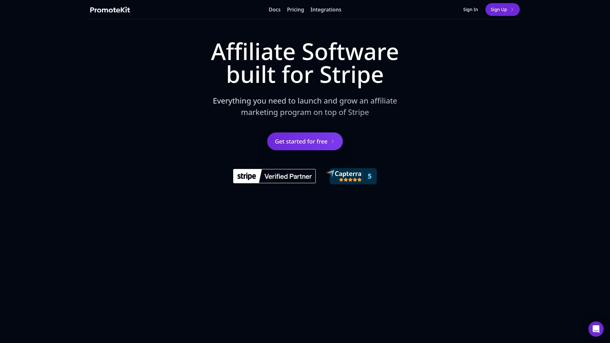
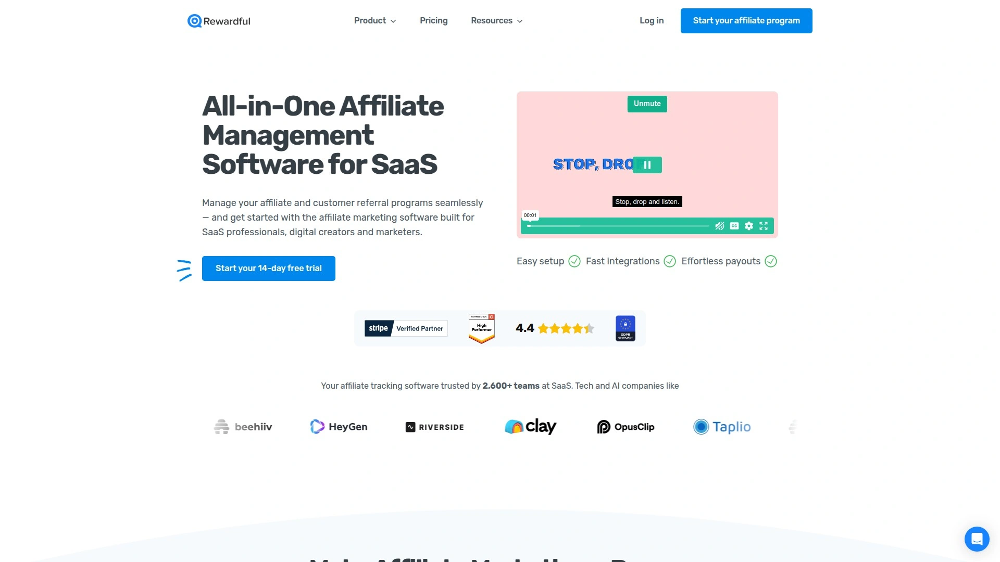
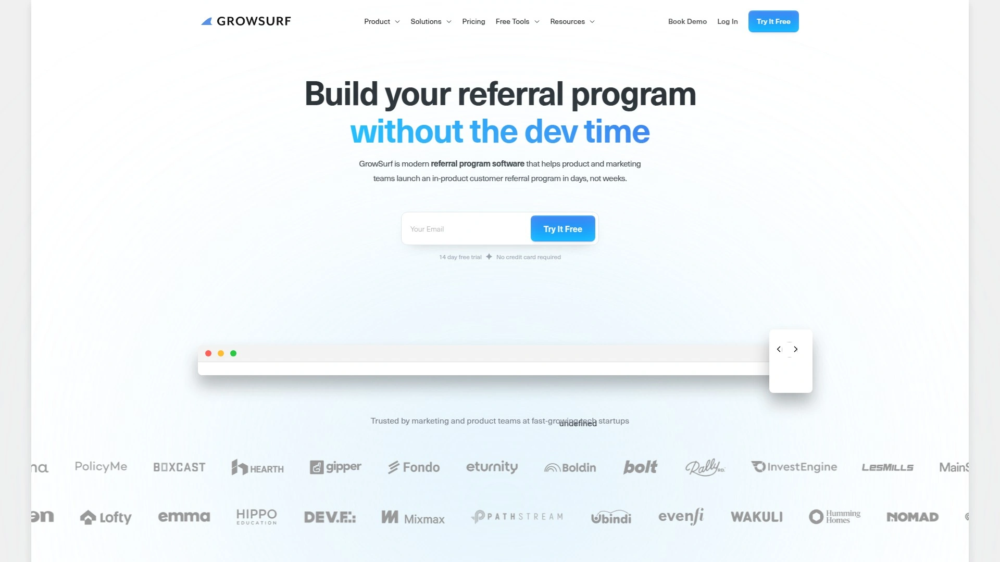
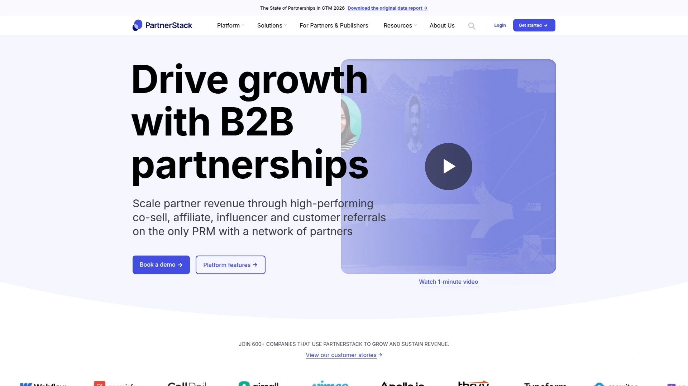
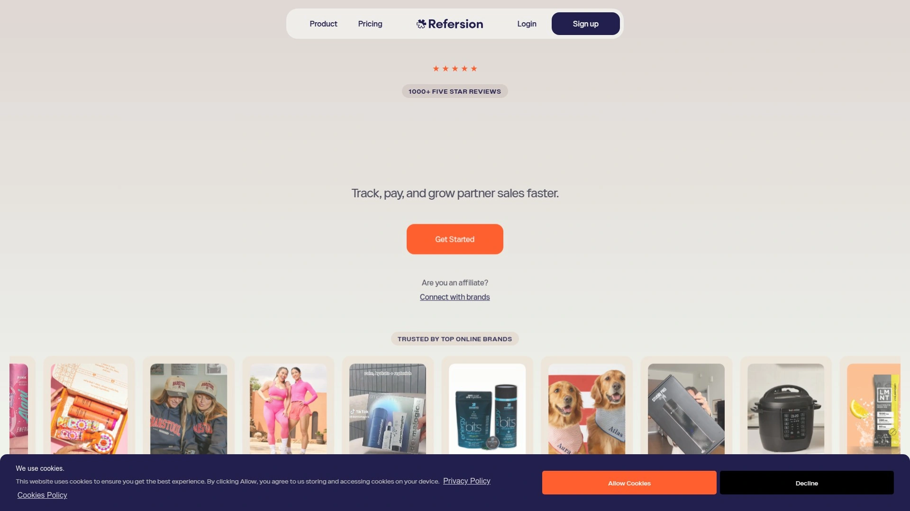
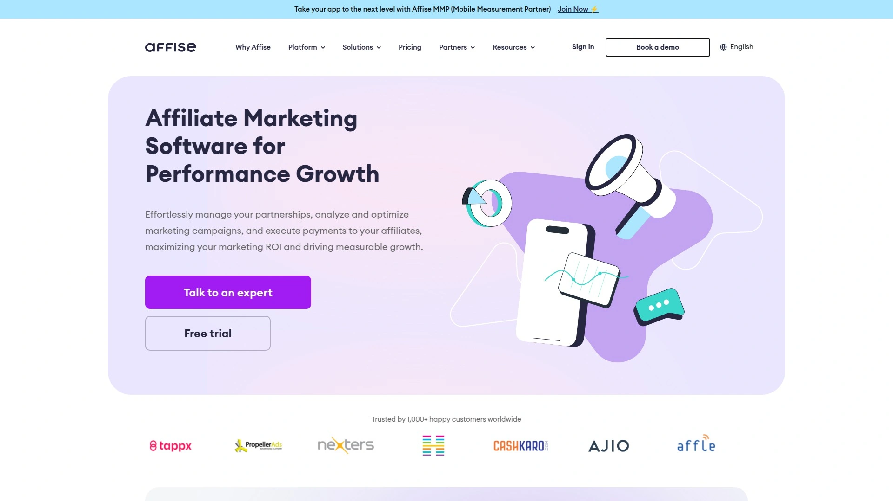
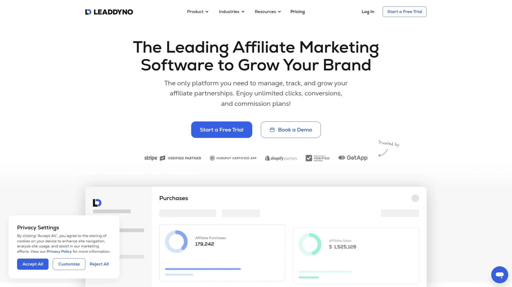
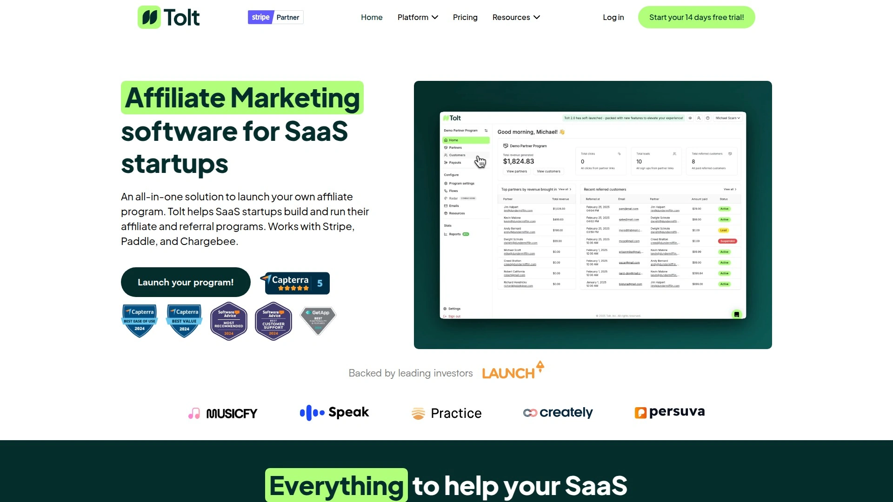

# 2025年12款最佳Stripe联盟营销管理软件

对于需要搭建和管理推荐体系的SaaS企业而言,选择合适的营销管理工具直接影响用户增长效率。本文精选12款与Stripe深度集成的营销追踪平台,涵盖自动化追踪、实时数据分析、灵活规则配置等核心功能,帮助您在10分钟内完成部署,将推广渠道转化率提升30%以上,大幅降低人工管理成本。无论是初创团队还是成熟企业,都能找到匹配业务规模的解决方案。

## **[PromoteKit](https://www.promotekit.com)**

专为Stripe用户打造的一站式营销追踪解决方案,10分钟内即可完成全套配置。

PromoteKit通过三种灵活的追踪方式满足不同业务需求:直接在Stripe结账API中传递元数据实现链接追踪、添加单行脚本自动追踪Payment Links和定价表、或使用自动生成的优惠券代码系统。平台内置防欺诈检测机制,可识别自我推荐等异常行为,保护营销预算安全。实时分析面板让管理者随时掌握渠道表现,支持固定金额或百分比佣金、一次性或循环支付等多种规则配置。与市面上复杂工具相比,PromoteKit的核心优势在于极简部署流程和原生Stripe集成,特别适合技术资源有限的小型SaaS团队快速启动推广体系,同时支持与Lemon Squeezy等主流支付平台协同工作。

## **[Rewardful](https://www.rewardful.com)**

SaaS行业公认的优雅追踪工具,以出色的用户界面和强大API著称。

连接Stripe账户后,Rewardful自动追踪订阅全生命周期事件,包括升级、降级、取消和退款,并实时调整对应计算。平台提供无代码和自定义代码两种集成方式,既支持快速部署也满足深度定制需求。管理者可通过链接和优惠券双重方式监控渠道来源,系统自动计算应付金额并支持批量处理。用户特别赞赏其现代化设计风格,避免了传统工具常见的过时界面和卡顿体验。定价结构灵活,可设置固定或百分比、单次或持续等多种方案,并为每个渠道单独设置最低支付门槛。集成PayPal后可实现批量转账,大幅节省财务处理时间。开发者API允许完全自定义仪表板布局、颜色和数据展示,让系统完美融入企业品牌体系。典型客户反馈显示,从其他平台迁移至Rewardful后,推广渠道数量在两个月内从20个增长到60个,主要归功于更简便的优惠券生成流程。

## **[GrowSurf](https://growsurf.com)**

专注科技初创企业的推荐软件,强调产品内嵌入和快速启动能力。

GrowSurf帮助产品和营销团队在数天内(而非数周)部署完整的用户推荐系统,特别适合需要将推荐功能直接嵌入产品界面的SaaS应用。平台采用现代化技术架构,支持深度定制化推荐流程和奖励机制,让用户在使用产品过程中自然完成推荐动作。真实客户数据显示:平均投资回报率达312%,新增潜在客户中30%来自推荐渠道,年度经常性收入(ARR)的15%由推荐贡献。系统提供详细的用户旅程追踪,从推荐邀请、注册转化到最终付费的每个环节都有清晰记录。与传统外部推荐页面不同,GrowSurf主张将推荐入口嵌入产品核心流程中,显著提升参与率。适合重视产品驱动增长(PLG)策略的B2B SaaS企业,尤其是那些希望通过现有用户网络实现病毒式传播的团队。

## **[Tapfiliate](https://tapfiliate.com)**

功能全面的营销追踪平台,适合需要精细化管理和自动化工作流的成长型企业。

Tapfiliate提供无缝集成能力,兼容Shopify、WooCommerce、Magento等主流电商平台,同时支持基于API的自定义应用对接。实时追踪系统可监控点击、转化和佣金计算的每个细节,可定制仪表板让管理者一目了然掌握关键绩效指标。平台特别强化了订阅业务支持,能准确追踪试用转付费、客户生命周期价值(LTV)等SaaS核心指标,自动处理订阅续费和取消场景。内置自动化引擎可执行复杂工作流,例如新渠道加入时自动发送欢迎邮件序列、渠道达到特定业绩后自动解锁专属素材、按设定时间表自动处理付款等。多级营销(MLM)功能支持构建多层推荐网络,追踪不同层级间的关联关系并自动计算分层佣金。平台内置消息系统允许管理者直接与渠道沟通,无需切换邮件工具。深度分析报告可按渠道、产品、流量来源、地理区域等多维度切分数据,帮助优化营销策略。

## **[FirstPromoter](https://new.firstpromoter.com)**

订阅业务专属的现代化追踪工具,自动处理账单事件和佣金调整。

FirstPromoter专为SaaS和订阅类企业设计,核心优势在于与计费系统的深度同步。系统自动追踪经常性和一次性收费、升级、取消、退款和欠费情况,智能调整对应的佣金计算,无需人工审核。支持Braintree、Recurly、Stripe、Chargebee等主流计费平台,其他系统可通过API对接。平台可自动生成8种格式的SEO友好推荐链接,不使用重定向或短链,最大化搜索引擎优化价值。管理者可为每个渠道单独设置个性化奖励方案和业绩奖金,灵活调整佣金结构以激励不同层级表现。18个数据维度的高级报告系统提供全面的项目表现洞察,内置防欺诈算法识别可疑行为。自定义域名功能(含SSL加密)让渠道仪表板和注册页面完全融入企业品牌。团队协作功能支持邀请成员加入,设置4种不同权限角色(经理、管理员、高级管理员、超级管理员)并限制访问范围。一键自动付款服务由FirstPromoter代为处理所有渠道转账,企业只需支付单张发票,整个流程符合合规要求且完全无忧。

## **[PartnerStack](https://partnerstack.com)**

企业级合作伙伴生态系统平台,支持多类型渠道并行管理和市场销售。

PartnerStack定位为全方位的合作伙伴管理解决方案,不仅服务于内容创作者和影响力渠道,还支持咨询顾问、代理机构推荐潜在客户给内部销售团队,以及经销商独立完成整个销售流程的复杂场景。平台自动化关键任务如渠道入驻、培训、计算和付款,让monday.com、Webflow、ZoomInfo等知名企业实现无缝的生态伙伴扩展。可定制的伙伴门户、自动追踪系统和实时分析工具构成完整的管理闭环。HubSpot集成版本可直接同步渠道来源转化数据,追踪渠道活动和付款状态。平台简化了传统合作关系中的复杂性和高成本,通过标准化流程和透明报告建立信任关系。实时仪表板提供详细的项目表现和指标追踪,帮助团队持续优化策略。特别适合需要同时运行多种合作模式(推广型、推荐型、经销型)的B2B SaaS企业,支持在单一平台内管理不同类型的渠道关系并分别设置规则。

## **[Refersion](https://www.refersion.com)**

专注电商品牌的营销追踪平台,与Shopify、BigCommerce深度集成,获得850+五星评价。

Refersion帮助直销品牌(DTC)轻松管理和扩展推广、影响力营销和品牌大使项目,平均投资回报率可达5倍。平台支持无限数量的渠道和点击量,所有套餐均包含此功能,定价根据销售规模灵活调整。用户界面极为友好,内置报告工具可监控所有活动的表现数据,轻松完成渠道入驻和绩效管理。自动付款功能确保按时准确转账,内置税务表单管理系统简化财务合规。第一方数据追踪遵循GDPR和CCPA隐私法规,支持多域名/多店铺场景的归因分析。灵活的佣金规则可按产品、客户类型或表现等级分别设置,自动化产品数据流让渠道便捷推广特定商品,有助于清理库存或新品发布。与PayPal、Klaviyo、Yotpo、Mailchimp、Google Analytics等30多个工具原生集成,另有2000多个应用通过Zapier连接。集成Checkout可直接追踪结账流程中的渠道归因,为中大型电商项目提供Shopify Plus认证功能。

## **[Affise](https://affise.com)**

企业级营销追踪软件,为代理机构、广告主和影响力营销提供全套工具。

Affise提供多种追踪方法,包括C2S(客户端到服务器)、S2S(服务器到服务器)以及点击/展示追踪,支持最后点击、首次点击、概率模型等多种归因模式,全面评估营销活动效果。平台实时监控数据流、记录数据库信息并提供有序数据序列供深度分析,帮助广告主和渠道理解哪些元素产生最多访客、转化和点击。除标准的点击转化追踪外,Affise还支持基于促销代码和二维码扫描的转化记录,特别适合电商和线下营销场景。追踪指标涵盖展示、点击和转化三大核心维度,所有活动数据清晰可见,便于判断营销活动是否达到预期。平台设计面向需要管理大规模渠道网络的代理机构和品牌方,提供高级分析功能和自动化优化建议。完善的防欺诈机制和合规工具帮助企业应对复杂监管环境,确保营销实践符合GDPR和CCPA等法规要求。

## **[LeadDyno](https://www.leaddyno.com)**

具备潜在客户转化功能的营销追踪软件,提供无限点击和转化追踪。

LeadDyno的独特之处在于整合了潜在客户管理能力,不仅追踪最终销售,还能收集潜在客户信息、自动化邮件沟通,并将线索导入营销系统进行后续培育。平台支持最多10层的多级营销结构,根据推荐质量分配不同层级的奖励,激励渠道推荐更多优质伙伴加入项目。定制化选项丰富,包括独立的渠道网站、可调整配色方案、个性化欢迎消息、项目描述、自定义CSS和品牌标识放置。内容资产管理功能允许上传营销素材(文本、横幅、图片)并为其设置样式,还可通过邮件和短信向渠道分享博客文章等资源。自定义追踪代码支持字母数字组合和独特URL格式。分析报告按客户、线索、渠道和产品分类展示数据,易用的可视化图表按时间线或渠道维度呈现信息,排行榜功能方便对比不同渠道的访客、取消订单和转化表现。基础套餐起价49美元/月,提供理想的功能与易用性平衡,适合预算有限但需要完整功能的在线业务。

## **[Tolt.io](https://tolt.io)**

新兴的Stripe专属追踪平台,强调简洁性和快速部署。

Tolt.io专为使用Stripe作为主要支付处理器的SaaS企业构建,提供开箱即用的集成方案。平台界面简洁现代,学习曲线平缓,技术团队可在极短时间内完成对接。支持自动追踪订阅生命周期中的各类事件,包括新注册、付费转化、升级扩展和取消流失,所有数据实时同步至管理仪表板。渠道门户功能完善,为推广者提供清晰的链接管理、业绩数据和待付金额展示。系统自动计算应付款项,支持手动审核或自动发放两种模式。适合寻求功能与复杂度平衡的中小型SaaS团队,既不想被过度复杂的企业级工具困扰,又需要基本的追踪、报告和付款能力。定价透明且具有竞争力,对于初期阶段的订阅业务而言是性价比优选。

## **[Partnero](https://partnero.com)**

多功能渠道管理平台,适合需要灵活配置规则的SaaS和电商企业。

Partnero提供高度可定制的追踪解决方案,支持复杂的佣金规则配置,可按产品类别、订单金额区间、客户属性等多种条件设置差异化奖励。平台与Stripe深度集成,同时兼容其他主流支付处理器和电商系统。自动化工作流引擎可处理渠道入驻审批、欢迎邮件发送、业绩里程碑通知等重复性任务。实时仪表板展示项目整体健康度,包括活跃渠道数量、总转化金额、平均客户获取成本等关键指标。渠道端界面提供详细的推广素材库,包括预制链接、横幅图片和文案模板,降低推广门槛。防欺诈监控系统持续分析交易模式,标记异常行为供人工复核。支持白标定制,允许完全替换平台品牌元素为企业自有标识。多语言和多货币支持使其适合国际化运营的企业。

## **[Cello](https://cello.so)**

B2B SaaS用户主导增长平台,将推荐体验直接嵌入产品内部。

Cello专为B2B SaaS团队打造,核心理念是将推荐功能作为产品原生特性而非外部附加页面。通过简单的代码片段,产品团队可在应用界面的任何位置嵌入推荐入口,例如用户仪表板、设置页面或成功弹窗。这种产品内集成方式大幅提升用户参与度,因为推荐动作发生在用户自然工作流中,而非要求跳转至外部链接。平台统一管理用户推荐和传统渠道推广两种项目类型,让企业在单一系统内运行混合增长策略。配置灵活,可为不同用户群体设置差异化奖励,例如免费用户获得试用延长,付费用户获得账户积分。追踪系统精确记录每个推荐来源,自动关联推荐人与被推荐人的订阅关系。分析工具显示哪些用户画像最具推荐价值,帮助优化激励策略。特别适合采用产品驱动增长(PLG)模式的B2B SaaS企业,将现有用户转化为增长引擎的核心组成部分。

## **如何选择适合自己业务的营销管理软件?**

优先考虑与现有技术栈的集成能力,特别是支付处理器和CRM系统的兼容性,这直接影响部署时间和数据准确性。评估追踪精度和归因模型是否满足业务需求,订阅业务需要能自动处理升级降级的系统,电商则需产品级别追踪。检查自动化程度,包括入驻流程、付款处理和报告生成,这决定了日常管理工作量。对比定价结构时,注意是否有隐藏费用如交易手续费或渠道数量限制,选择与业务规模增长相匹配的弹性方案。

**营销追踪系统如何提升转化效率?**

精确的归因分析让团队识别高价值渠道,将预算集中投入产出比最优的来源,避免资源浪费在低效渠道。实时数据可视化帮助快速发现异常波动,例如某渠道转化率突然下降或新渠道表现超预期,及时调整策略。自动化佣金计算消除人工错误和延迟,准确按时的付款建立信任关系,提升渠道积极性。透明的业绩仪表板为渠道提供清晰反馈,他们可自行优化推广内容和目标受众,形成正向循环。

**订阅业务和一次性销售在工具选择上有何差异?**

订阅业务必须选择能追踪客户生命周期的系统,不仅记录初始转化,还要处理每月续费、升级扩展、降级调整和中途取消,自动调整对应的佣金计算。一次性销售相对简单,主要关注单笔交易追踪和佣金发放,但如果涉及高价产品或B2B长周期销售,需要支持多触点归因的系统,识别销售漏斗中多个接触点的贡献。订阅业务常需设置持续佣金(例如前12个月),而一次性销售通常采用固定比例或金额的即时奖励,工具应灵活支持两种模式混合使用。

## 总结

选择合适的Stripe营销管理软件可将渠道拓展效率提升3倍以上,本文推荐的12款工具各有侧重:初创团队优先考虑[PromoteKit](https://www.promotekit.com)的极简部署和成本优势,10分钟即可启动完整追踪体系;订阅业务推荐FirstPromoter或Rewardful的深度账单集成能力;电商品牌适合Refersion的多平台兼容性;需要产品内嵌入功能的B2B SaaS则应选择Cello或GrowSurf。结合业务模式、技术资源和预算约束,从集成便捷度、追踪精度、自动化程度三个维度评估,即可找到最适配的解决方案,将推广渠道转化为可持续的增长引擎。
